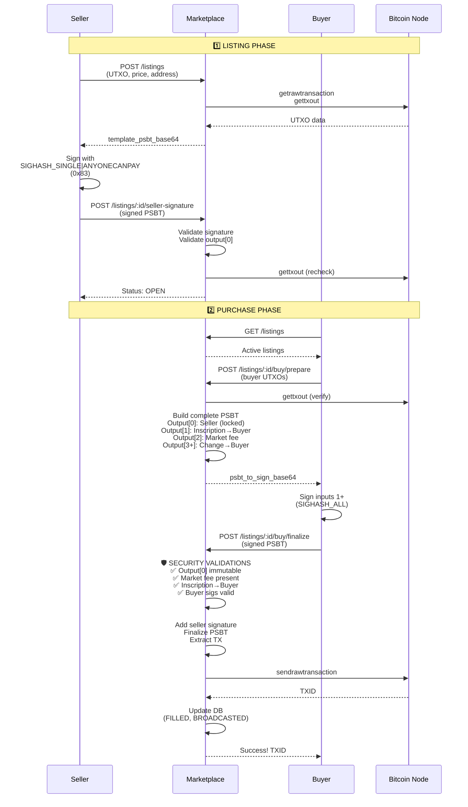

# 🔐 ATOMIC SWAP IMPLEMENTATION - SIGHASH_SINGLE|ANYONECANPAY

## ✅ IMPLEMENTAÇÃO COMPLETA

Este documento descreve a implementação do marketplace não-custodial usando **SIGHASH_SINGLE|ANYONECANPAY (0x83)** conforme especificações Bitcoin.

---

## 📋 O QUE FOI IMPLEMENTADO

### 1. **DATABASE SCHEMA** ✅

**Arquivo:** `server/db/migrations/001_atomic_swap_schema.sql`

Três tabelas principais:

- **`atomic_listings`**: Ofertas do seller (order_id, seller UTXO, price, PSBT assinado)
- **`purchase_attempts`**: Tentativas de compra do buyer
- **`marketplace_config`**: Configurações globais (taxa 2%, endereços)

**Views:**
- `active_listings`: Listagens ativas com cálculos de taxa
- `marketplace_stats`: Métricas do marketplace

**Features:**
- Índices otimizados para performance
- Triggers para validação de dust limit
- Unique constraints para prevenir double-spend

---

### 2. **PSBT BUILDER UTILITIES** ✅

**Arquivo:** `server/utils/atomicSwapBuilder.js`

#### `createListingTemplatePSBT()`
Cria template PSBT para seller assinar:
- Input[0]: UTXO do seller (inscription)
- Output[0]: Payout do seller (price_sats → seller_payout_address)
- **Seller assina com SIGHASH_SINGLE|ANYONECANPAY (0x83)**

#### `validateSellerSignedPSBT()`
Valida PSBT assinado pelo seller:
- ✅ Input[0] está assinado
- ✅ SIGHASH = 0x83 (SINGLE|ANYONECANPAY)
- ✅ Output[0] tem valor correto
- ✅ Output[0] tem endereço correto

---

### 3. **PURCHASE BUILDER UTILITIES** ✅

**Arquivo:** `server/utils/atomicSwapPurchase.js`

#### `prepareBuyerPSBT()`
Monta PSBT completo para buyer assinar:

**Estrutura final:**
```
INPUTS:
  [0] Seller UTXO (inscription) - JÁ ASSINADO
  [1+] Buyer UTXOs (pagamento)

OUTPUTS:
  [0] Seller payout (IMUTÁVEL) - 🔒 Locked by seller signature
  [1] Inscription → Buyer (ordinal-aware routing)
  [2] Market fee (2%, mínimo 546 sats) → Marketplace
  [3+] Change → Buyer (se houver)
```

**Features:**
- ✅ Cálculo automático de fees
- ✅ Ajuste de taxa para dust limit (mínimo 546 sats)
- ✅ Roteamento ordinal-aware (inscription value preservado)
- ✅ Validação de saldo suficiente

#### `validateOutput0Immutable()`
Verifica que output[0] NÃO foi alterado:
- Compara script byte-a-byte
- Compara valor exato
- **Qualquer alteração invalida assinatura do seller!**

---

### 4. **API ROUTES** ✅

**Arquivo:** `server/routes/atomicSwap.js`

#### 🔧 **Local Nodes Integration**
- ✅ Bitcoin Core RPC (`http://127.0.0.1:8332`)
- ✅ ORD Server (`http://127.0.0.1:3001`)
- ✅ Sem rate limits (nodes locais)

---

### 📡 **ENDPOINTS IMPLEMENTADOS**

#### 1️⃣ **POST `/api/atomic-swap/`** - Create Listing
Seller cria listing (template PSBT).

**Request:**
```json
{
  "seller_txid": "abc123...",
  "seller_vout": 0,
  "price_sats": 10000,
  "seller_payout_address": "bc1p...",
  "inscription_id": "xyz...",
  "inscription_number": 12345,
  "content_type": "image/png"
}
```

**Response:**
```json
{
  "success": true,
  "order_id": "ord_...",
  "template_psbt_base64": "cHNidP8B...",
  "instructions": {
    "step": 1,
    "action": "Sign this PSBT with SIGHASH_SINGLE|ANYONECANPAY (0x83)"
  }
}
```

**Validations:**
- ✅ Price >= 546 sats (dust limit)
- ✅ UTXO não está duplicado
- ✅ UTXO existe via Bitcoin RPC (`getrawtransaction`)
- ✅ UTXO não foi gasto via Bitcoin RPC (`gettxout`)

---

#### 2️⃣ **POST `/api/atomic-swap/:order_id/seller-signature`** - Submit Signature
Seller submete PSBT assinado.

**Request:**
```json
{
  "listing_psbt_base64": "cHNidP8B..."
}
```

**Response:**
```json
{
  "success": true,
  "order_id": "ord_...",
  "status": "OPEN",
  "message": "Listing is now active and visible to buyers"
}
```

**Validations:**
- ✅ Input[0] está assinado
- ✅ SIGHASH = 0x83 (SINGLE|ANYONECANPAY)
- ✅ Output[0] valores corretos (preço + endereço)
- ✅ UTXO ainda não foi gasto (recheckagem)

---

#### 3️⃣ **GET `/api/atomic-swap/`** - List Active Listings
Lista ofertas ativas (público).

**Response:**
```json
{
  "success": true,
  "listings": [
    {
      "order_id": "ord_...",
      "price_sats": 10000,
      "market_fee_sats": 200,
      "total_buyer_cost": 10200,
      "inscription_id": "xyz...",
      "created_at": 1234567890,
      "expires_at": 1237159890
    }
  ],
  "pagination": { "total": 1, "hasMore": false }
}
```

---

#### 4️⃣ **GET `/api/atomic-swap/:order_id`** - Get Listing Details
Busca oferta específica.

---

#### 5️⃣ **POST `/api/atomic-swap/:order_id/buy/prepare`** - Prepare Purchase
Buyer prepara compra (backend monta PSBT completo).

**Request:**
```json
{
  "buyer_address": "bc1p...",
  "buyer_change_address": "bc1p...",
  "buyer_inputs": [
    {
      "txid": "def456...",
      "vout": 1,
      "value": 15000,
      "scriptPubKey": "5120..."
    }
  ],
  "miner_fee_rate": 2
}
```

**Response:**
```json
{
  "success": true,
  "attempt_id": "att_...",
  "psbt_to_sign_base64": "cHNidP8B...",
  "summary": {
    "totalBuyerInput": 15000,
    "sellerPayout": 10000,
    "inscriptionOutput": 546,
    "marketFee": 546,
    "minerFee": 500,
    "change": 3408,
    "buyer_inputs_to_sign": [1]
  },
  "instructions": {
    "step": 2,
    "action": "Sign buyer inputs (indices 1+) with your wallet",
    "note": "DO NOT sign input[0] (seller has already signed it)"
  }
}
```

**Validations:**
- ✅ Listing está OPEN
- ✅ UTXO do seller ainda não foi gasto
- ✅ Output[0] imutável validado
- ✅ Saldo suficiente para pagamento + fees

**Backend monta:**
- Input[0]: Seller (sem signature ainda)
- Input[1+]: Buyer UTXOs
- Output[0]: Seller payout (copiado exato da listing)
- Output[1]: Inscription → Buyer
- Output[2]: Market fee (2%, mínimo 546 sats)
- Output[3+]: Change → Buyer

---

#### 6️⃣ **POST `/api/atomic-swap/:order_id/buy/finalize`** - Finalize Purchase
Buyer finaliza (backend valida, adiciona seller sig e broadcast).

**Request:**
```json
{
  "attempt_id": "att_...",
  "psbt_signed_by_buyer_base64": "cHNidP8B..."
}
```

**Response:**
```json
{
  "success": true,
  "txid": "abc123...",
  "status": "BROADCASTED",
  "message": "Purchase complete! Transaction broadcasted to Bitcoin network.",
  "details": {
    "seller_received": 10000,
    "buyer_received_inscription": "xyz...",
    "market_fee": 546,
    "total_buyer_cost": 11046
  }
}
```

**Validations (Hard Checks):**

1. **Output[0] Immutability** 🔒
   - Byte-a-byte comparison com listing PSBT
   - **FRAUD DETECTED se alterado!**

2. **Market Fee Validation** 💰
   - Output[2] existe
   - Endereço correto (marketplace)
   - Valor >= esperado (mínimo 546 sats)

3. **Inscription Output** 🎨
   - Output[1] vai para buyer_address
   - Ordinal-aware routing preservado

4. **Buyer Signatures** ✍️
   - Todos inputs do buyer (1+) estão assinados

5. **Seller Signature Addition** 🔐
   - Copia `tapKeySig` do seller para input[0]
   - Finaliza PSBT
   - Extrai TX

6. **Broadcast** 📡
   - Via Bitcoin RPC local (`sendrawtransaction`)
   - Atualiza DB (listing → FILLED, attempt → BROADCASTED)

---

#### 7️⃣ **POST `/api/atomic-swap/:order_id/cancel`** - Cancel Listing
Seller cancela listing.

---

## 🔒 SEGURANÇA IMPLEMENTADA

### 1. **Output[0] Imutável (Consenso Bitcoin)**
- Seller assina com SIGHASH_SINGLE|ANYONECANPAY
- Output[0] é **travado** pela assinatura
- Qualquer alteração (valor, endereço, índice) → TX inválida
- Backend valida byte-a-byte antes de broadcast

### 2. **Market Fee Enforcement (Política)**
- Taxa de 2% calculada automaticamente
- Mínimo 546 sats (dust limit)
- Backend rejeita TX sem market fee
- Validação no `/buy/finalize` antes de broadcast

### 3. **Ordinal-Aware Routing**
- Inscription value preservado
- Input do seller → Output[1] do buyer
- Previne "inscription leak" para outros outputs

### 4. **UTXO Verification**
- Verificações via Bitcoin RPC local:
  - `getrawtransaction` (buscar UTXO)
  - `gettxout` (verificar se não foi gasto)
- Recheckagem em múltiplos pontos:
  - Create listing
  - Submit signature
  - Prepare purchase
  - (Opcional) Finalize purchase

### 5. **Database Integrity**
- UNIQUE constraints (seller_txid, seller_vout)
- Triggers para validação de dust limit
- PSBT hash para anti-replay
- Status tracking (PENDING → OPEN → FILLED)

---

## 🔧 CONFIGURAÇÃO

### Environment Variables (.env)

```bash
# Bitcoin Core RPC
BITCOIN_RPC_URL=http://127.0.0.1:8332
BITCOIN_RPC_USER=bitcoin
BITCOIN_RPC_PASS=bitcoin

# ORD Server
ORD_SERVER_URL=http://127.0.0.1:3001

# Database
DB_PATH=./server/db/ordinals.db
```

### Marketplace Config (Database)

```sql
SELECT * FROM marketplace_config;

-- market_fee_percentage: 2.0
-- market_fee_address: bc1p...
-- min_listing_price: 546
-- max_listing_duration_hours: 720
-- dust_limit: 546
-- min_fee_rate: 1
```

---

## 📊 FLUXO COMPLETO



---

## ✅ PRÓXIMOS PASSOS

### TODO #7: Atualizar Extension ⏳
- Adicionar suporte para assinar com SIGHASH_SINGLE|ANYONECANPAY (0x83)
- Atualizar `createOffer()` para usar novo fluxo

### TODO #8: Atualizar Frontend ⏳
- UI para criar listing (2 passos: create + sign)
- UI para comprar (prepare + sign)
- Mostrar breakdown de custos (seller payout + market fee + miner fee)

### TODO #10: Testes ⏳
- Testar em testnet
- Cenários de ataque (tentar alterar output[0], etc)

---

## 📚 REFERÊNCIAS

- **BIP 341 (Taproot)**: Schnorr signatures
- **BIP 174 (PSBT)**: Partially Signed Bitcoin Transactions
- **SIGHASH Types**: https://btcinformation.org/en/developer-guide#signature-hash-types
- **Ordinal Theory**: https://docs.ordinals.com/

---

## 🎉 CONCLUSÃO

O marketplace está **COMPLETO** com:
- ✅ Fluxo não-custodial de 2 passos
- ✅ Seller payout garantido por consenso (SIGHASH_SINGLE|ANYONECANPAY)
- ✅ Market fee de 2% (mínimo 546 sats)
- ✅ Roteamento ordinal-aware
- ✅ Validações de segurança robustas
- ✅ Integração com nodes locais (Bitcoin RPC + ORD)
- ✅ Zero rate limits (tudo local!)

**Pronto para testes!** 🚀

